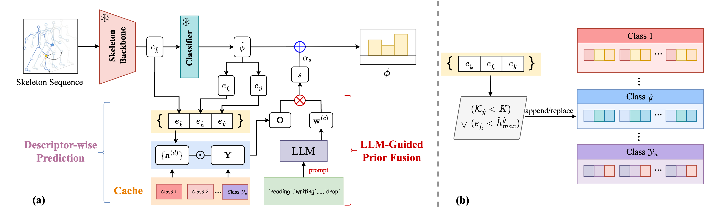

Based on the paper, here's a concise README:

---

# Skeleton-Cache

**Boosting Skeleton-based Zero-Shot Action Recognition with Training-Free Test-Time Adaptation**

Official implementation of our NeurIPS 2025 paper.

## Overview



Skeleton-Cache is the **first training-free test-time adaptation framework** for skeleton-based zero-shot action recognition. It dynamically adapts pre-trained models to unseen actions during inference without any gradient updates or training data.

**Key Features:**
- Training-free test-time adaptation
- Structured cache with global + fine-grained descriptors
- LLM-guided semantic fusion
- Plug-and-play with existing SZAR backbones

**Results:** +7.04% on NTU 60 (SA-DVAE) | +6.24% on NTU 60 (PURLS)

## Quick Start

```bash
# Installation
git clone https://github.com/Alchemist0754/Skeleton-Cache.git
cd Skeleton-Cache
pip install -r requirements.txt

# Run inference
python test.py --dataset ntu60 --split 55_5 --backbone sa_dvae --cache_size 8
```

## Data Preparation

**Download pre-generated LLM priors:**
- [NTU RGB+D Prior Files](https://drive.google.com/file/d/1b4C5LZY8c1XEdOKcH7GxXrx5U6YISSur/view?usp=sharing)
- [PKU-MMD Prior Files](https://drive.google.com/file/d/1CbECDFeNI3gAr1CrFD5UMGnYGXDUC3sl/view?usp=drive_link)

Other datasets and pretrained models will be added to the pipeline.

## To-Do List

- [ ] Release Skeleton-Cache core implementation
- [ ] Release backbone integration scripts 
- [ ] Add complete dataset preprocessing scripts

## Citation

```bibtex
@inproceedings{zhu2025skeletoncache,
  title={Boosting Skeleton-based Zero-Shot Action Recognition with Training-Free Test-Time Adaptation},
  author={Zhu, Jingmin and Zhu, Anqi and Rahmani, Hossein and Liu, Jun and Bennamoun, Mohammed and Ke, Qiuhong},
  booktitle={NeurIPS},
  year={2025}
}
```

## Contact

For questions, please contact: jingmin.zhu1@monash.edu
